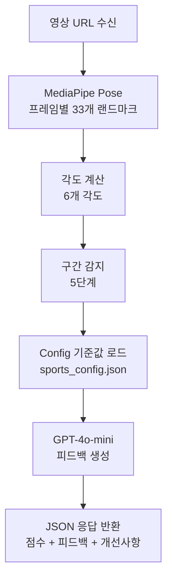

# MotionLab AI Server

> 운동 영상 AI 분석 서버 — MediaPipe 포즈 추출 + GPT-4o-mini 피드백

---

## 📖 Overview

NestJS 백엔드로부터 영상 URL을 받아 AI 분석을 수행하고
점수, 피드백, 개선사항을 반환하는 분석 전용 서버입니다.

**분석 단계**:
- 📥 영상 다운로드
- 🦴 MediaPipe Pose로 프레임별 관절 좌표 추출
- 📐 6개 각도 계산 (팔, 척추, 골반-어깨, 무릎)
- 🔍 구간 감지 (address → backswing → top → downswing → follow_through)
- 🤖 GPT-4o-mini로 피드백 + 점수 + 개선사항 생성
- 📤 JSON 응답 반환
---

## 🔬 Analysis Flow


---

## 🛠️ Tech Stack


---

## 📁 Project Structure

```text
.
├── api/
│   ├── analyze.py                  # POST /analyze 엔드포인트
│   └── health.py                   # GET /health 헬스체크
├── config/
│   └── settings.py                 # 환경 설정
├── core/
│   ├── prompts/
│   │   ├── templates/
│   │   │   ├── _shared/
│   │   │   │   └── base.yaml       # 공통 프롬프트 (환각 방지)
│   │   │   ├── golf/
│   │   │   │   ├── driver.yaml
│   │   │   │   ├── iron.yaml
│   │   │   │   ├── putter.yaml
│   │   │   │   └── wedge.yaml
│   │   │   └── weight/
│   │   │       ├── benchpress.yaml
│   │   │       ├── deadlift.yaml
│   │   │       └── squat.yaml
│   │   └── loader.py              # YAML 프롬프트 로더
│   ├── sport_configs/
│   │   ├── golf/
│   │   │   ├── driver_config.py
│   │   │   ├── iron_config.py
│   │   │   └── putter_config.py
│   │   ├── weight/
│   │   │   ├── bench_press_config.py
│   │   │   ├── deadlift_config.py
│   │   │   └── squat_config.py
│   │   ├── base_config.py         # Config 베이스 클래스
│   │   └── sports_config.json     # 종목별 기준값 JSON
│   ├── angle_calculator.py         # 6개 각도 계산
│   ├── landmarks.py                # MediaPipe 랜드마크 상수
│   ├── llm_feedback.py             # GPT-4o-mini 호출
│   ├── mediapipe_analyzer.py       # MediaPipe 포즈 추출
│   └── phase_detector.py           # 스윙 구간 감지
├── models/
│   ├── requests/
│   │   └── analysis_request.py     # 요청 스키마
│   └── responses/
│       ├── analysis_response.py    # 응답 스키마
│       ├── error_response.py
│       └── health_response.py
├── services/
│   ├── analysis_service.py         # 분석 오케스트레이션
│   └── video_service.py            # 영상 다운로드/메타데이터
├── utils/
│   ├── exceptions/
│   │   └── errors.py               # 에러 코드 (AN_ / SYS_)
│   ├── decorators.py
│   ├── dependencies.py
│   ├── logger.py                   # 구조화 로깅
│   ├── response_builder.py
│   └── timer.py                    # 성능 측정
├── tests/
│   └── test_video_service.py
├── main.py                         # FastAPI 앱 엔트리
└── requirements.txt
```

---

## 🚀 Quick Start

### Installation

```bash
git clone https://github.com/{username}/motionlab-ai.git
cd motionlab-ai

python -m venv venv
source venv/bin/activate
pip install -r requirements.txt

# 환경 변수
cp .env.example .env
# .env에 OPENAI_API_KEY 설정
```
### Running
```bash
  uvicorn main:app --host 0.0.0.0 --port 8000 --reload
```
### Health Check
```bash
    GET http://localhost:8000/health
```

---

## 📡 API

### POST /analyze

**Request:**
```json
{
  "motion_id": 1,
  "sport_type": "golf",
  "sub_category": "DRIVER",
  "video_url": "http://localhost:3000/uploads/motions/u1/video.mp4"
}
```

**Response:**
```json
{
  "success": true,
  "result": {
    "total_frames": 192,
    "duration_seconds": 8.0,
    "angles": {
      "left_arm_angle": 153.2,
      "right_arm_angle": 130.4,
      "spine_angle": 117.1,
      "hip_shoulder_separation": 130.2,
      "left_knee_angle": 172.3,
      "right_knee_angle": 165.9
    },
    "phases": [
      { "name": "address", "start_frame": 0, "end_frame": 78, "duration_ms": 3250 }
    ]
  },
  "feedback": "현재 동작은 개선이 필요합니다...",
  "overall_score": 60,
  "improvements": [
    {
      "angle": "spine_angle",
      "current": 117.1,
      "ideal_range": [140, 170],
      "suggestion": "척추 각도를 140도 이상으로..."
    }
  ],
  "prompt_version": "cdce7dd"
}
```
---
### ⏱️ Performance (192 frames 기준)
| Step |	Time | Ratio |
|-----------|-------------|-------|
| 영상 다운로드 |	0.00s	|0%|
| 메타데이터 추출|	0.01s	|0%|
| MediaPipe 분석|	6.18s|	33%|
| Config 로드|	0.01s	|0%|
| 각도 계산 | 0.04s | 0% |
| 구간 감지 |	0.01s|	0%|
| LLM 피드백 |	7.81s	|42%|
| 총 소요 |	18.6s |	100%|

---

## 🔗 Related Repositories

| Repository | Description | Stack |
|-----------|-------------|-------|
| motionlab-server | 백엔드 API | NestJS + TypeORM |
| motionlab-ai | AI 분석 서버 **(현재 레포)** | FastAPI + MediaPipe |
| motionlab-front | 프론트엔드 | Next.js 16 |
| motionlab-config | 종목별 기준값 관리 | CSV → JSON |
